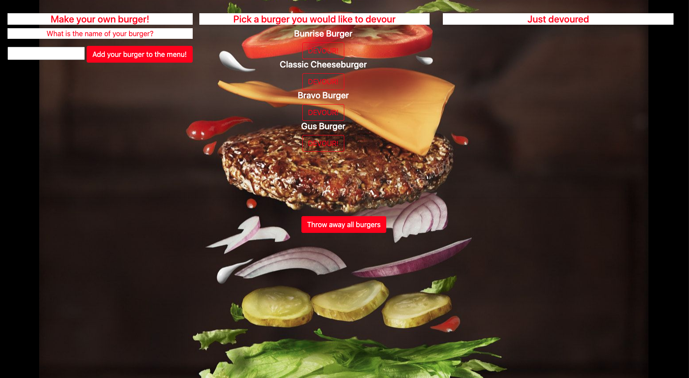

<h2> Note Taker </h2> 

<h2> Author </h2>

Kendall Masterson

https://github.com/mastersonkl

masterson.kendall@gmail.com

<h2> Description </h2>

This app uses Node, SQL, Express, Handlebars, and the MVC format. The app allows you to create burger names under Make your own burger! after you press the button Add your burger to the menu! then the burger name will be placed in the Pick a burger you would like to devour list. The user will then click on the DEVOUR! button underneath the burger name to move the burger to the Just devoured list. If the user presses the Throw away all burgers button at the bottom of the page all of the burgers on the page will be deleted.

Table of Contents

- [Installation Instructions](#installation-instructions)
- [Usage Information](#usage-information)

## Installation Instructions

You can install this program by cloning it to your local machine by running `git clone`. Run `npm i` to install the dependencies included in the package.json. After installing the program, run it in your terminal using node `node server.js`.

## Usage Information

This application is deployed on Heroku and can be found here: https://burger-burger0.herokuapp.com/

